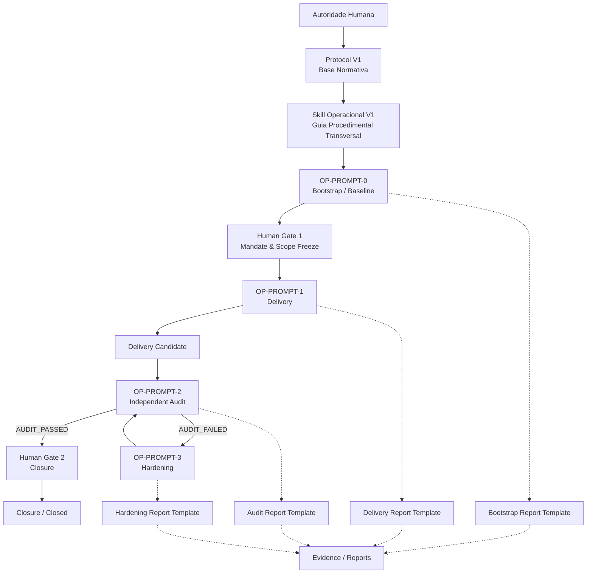

# Project Operational Kit

Repositório mestre do **Project Operational Kit**, concebido como uma bagagem operacional portátil, agnóstica e rigorosa para atuação em projetos novos, projetos existentes ou projetos defeituosos governados por IA.

---

## 1. Visão Geral e Afirmação Canônica de Escopo

O **Master Kit** é um sistema portátil de governança e engenharia operacional para projetos de software governados por Inteligência Artificial.

```text
MASTER KIT  ≠  PROJECT INSTANCE
```

* **Master Kit:** Fonte metodológica canônica e central de referência operacional.
* **Project Instance:** Instância operacional adotada e versionada por um projeto de software concreto.
* **Isolamento de Adaptações:** Qualquer customização ou adaptação decorrente de um projeto permanece circunscrita ao respectivo projeto.
* **Ciclo de Evolução:** Apenas melhorias estruturais validadas e de aplicabilidade geral dão origem a novas versões formais do Master Kit.

### O que o Master Kit É:
* Repositório mestre canônico e portátil de engenharia governada;
* Agnóstico a linguagens, frameworks, plataformas de hospedagem ou modelos de IA;
* Orientado à rastreabilidade causal total e à prova empírica verificável;
* Subordinado integralmente à soberania da autoridade humana.

### O que o Master Kit NÃO É:
* **NÃO** é um produto de software final ou aplicação específica;
* **NÃO** é um projeto de negócio com requisitos de domínio comercial;
* **NÃO** é um agente autônomo com poderes irrestritos de decisão;
* **NÃO** é um substituto da autoridade humana;
* **NÃO** é apenas uma coleção isolada de prompts (`MASTER KIT ≠ PROMPTS`);
* **NÃO** é apenas uma Skill isolada (`MASTER KIT ≠ SKILL`).

---

## 2. As Quatro Camadas do Master Kit

O ecossistema do Master Kit opera sob a separação categórica entre cinco conceitos complementares:

```text
PROTOCOL  ≠  SKILL  ≠  PROMPT  ≠  TEMPLATE  ≠  REPORT
```

```text
AUTORIDADE HUMANA SOBERANA (Nível 1)
        ↓ emite mandatos
BASE NORMATIVA & PROTOCOLO (protocol/v1/ — Níveis 2 e 3)
        ↓ operacionalizado por
SKILL OPERACIONAL (skills/operational-kit/SKILL.md)
        ↓ instrui execução via
CONTRATOS DE PROMPTS (prompts/v1/OP-PROMPT-0..3)
        ↓ produzem saídas estruturadas em
TEMPLATES DE RELATÓRIO (templates/prompt-*.md)
        ↓ geram
RELATÓRIOS & EVIDÊNCIAS PROBATÓRIAS (Reports duráveis)
        ↓ submetidos a
HUMAN GATES (Validação e Deliberação Soberana)
```

1. **`protocol/v1/` — Base Normativa:**  
   A lei substantiva e processual do ecossistema. Define os 6 Princípios Canônicos (`principles.md`), a Hierarquia de Autoridade de 5 níveis (`authority.md`), o Ciclo de Vida em 4 fases (`lifecycle.md`), os 12 Estados da Máquina de Estados (`state-machine.md`), a Taxonomia Epistemológica de 9 tipos (`evidence-taxonomy.md`) e os Arquétipos de Projeto (`project-archetypes.md`).
2. **`skills/operational-kit/` — Guia Procedimental Transversal:**  
   A Skill Operacional V1 (`SKILL.md`) é o guia de comportamento do agente. Ela instrui o agente sobre como obedecer ao protocolo, verificar pré-condições (PC-01 a PC-09) e manter o rigor epistêmico. *A Skill operacionaliza o protocolo; ela não cria autoridade própria nem homologa entregas.*
3. **`prompts/v1/` — Contratos Operacionais de Entrada:**  
   Contratos executáveis de controle de sessão (`OP-PROMPT-0` a `OP-PROMPT-3`). Cada prompt parametriza e delimita rigorosamente o que o agente pode e não pode fazer em cada fase específica do ciclo.
4. **`templates/` — Estruturas Formais de Saída e Governança:**  
   Modelos padronizados de relatórios (`templates/prompt-*-report.md`) e registro de exceções (`deviations.md.template`). Garantem que toda conclusão técnica seja documentada com suficiência probatória. *Um template é a forma vazia; o report é a evidência preenchida.*

---

## 3. História Evolutiva: Do Conceito aos Contratos Canônicos

A arquitetura dos Prompts Operacionais V1 consolida uma evolução estruturada:

```text
Conceito das Quatro Fases Canônicas (protocol/v1/lifecycle.md)
        ↓
Templates Probatórios de Saída (templates/prompt-*-report.md)
        ↓
Consolidação Procedimental do Agente (Skill Operacional V1)
        ↓
Contratos Formais Executáveis de Entrada (prompts/v1/OP-PROMPT-0..3)
```

A criação da Skill Operacional V1 não substituiu nem concorreu com os quatro prompts históricos. A arquitetura canônica separa:
* **SKILL:** *Como* o agente deve se comportar continuamente em qualquer interação.
* **PROMPTS:** *Qual* fase operacional específica do ciclo de vida está sendo deflagrada pelo operador, com quais entradas, limites e saídas.

---

## 4. Fluxo Operacional e Máquina de Estados

O ciclo de vida operacional organiza qualquer intervenção técnica em um fluxo determinístico fechado, estruturado em quatro etapas operacionais e dois Human Gates obrigatórios:



### Princípio da Execução: Delivery First → Audit Second
* **Delivery First (Fase 1 / OP-PROMPT-1):** O executor foca na resolução funcional objetiva do escopo autorizado, gerando testes locais e congelando a entrega em `DELIVERY_CANDIDATE`.
* **Audit Second (Fase 2 / OP-PROMPT-2):** O auditor independente atua sob postura formalmente cética e adversarial, confrontando o diff contra a base normativa e reproduzindo testes. O auditor aponta achados (`FINDINGS`); não conserta código nem possui veto soberano.
* **Hardening Cirúrgico (Fase 3 / OP-PROMPT-3):** Havendo achados na auditoria, a correção é estritamente vinculada aos findings apontados. Vedada a refatoração oportunista.
* **Regra de Ouro da Re-Auditoria:** `HARDENING ➔ RE-AUDITORIA`. É expressamente proibido saltar do Hardening para o fechamento (`HARDENING ↛ CLOSURE`). Toda remediação retorna compulsoriamente para o `OP-PROMPT-2`.

---

## 5. Soberania e Human Gates

O protocolo estabelece dois portões de controle obrigatórios onde a progressão autônoma cessa obrigatoriamente:

### Human Gate 1 (Mandate & Scope Freeze)
* **Momento:** Imediatamente após a emissão do Bootstrap Report (`DISCOVERY_READY`) e antes de qualquer escrita de código.
* **Função:** A autoridade humana avalia o diagnóstico fático e o Normative Baseline Record (NBR), arbitra eventuais lacunas ou conflitos, define a missão e autoriza formalmente o escopo congelado.

### Human Gate 2 (Closure & Governance)
* **Momento:** Exclusivamente após a auditoria independente emitir parecer conclusivo `AUDIT_PASSED`.
* **Função:** A autoridade humana revisa o laudo, autoriza a integração física (merge/deploy) e homologa institucionalmente o encerramento da missão (`CLOSED`).

> [!IMPORTANT]
> **Desacoplamento Categórico e Não-Auto-Aprovação:**
> `AUDIT_PASSED ≠ HOMOLOGATED` | `TESTED ≠ HOMOLOGATED` | `MERGED ≠ HOMOLOGATED`  
> A aprovação em testes ou auditoria atesta apenas conformidade técnica verificável. A homologação definitiva e a deliberação sobre integração pertencem com exclusividade à decisão humana. Silêncio humano jamais configura aprovação tácita.

---

## 6. Regime Epistemológico e de Evidências

Toda informação manipulada ou reportada dentro do Master Kit é categorizada em conformidade com a taxonomia ontológica de 9 tipos (`protocol/v1/evidence-taxonomy.md`):

* **`[FACT]`:** Fato empiricamente observado e verificável no ambiente real (exit code, hash de commit, arquivo existente).
* **`[EVIDENCE]`:** Registro durável, imutável e reproduzível que sustenta um fato (log com timestamp, diff Git).
* **`[REQUIREMENT]`:** Declaração prescritiva formalmente adotada no mandato ou norma.
* **`[HUMAN DECISION]`:** Determinação expressa, inequívoca e soberana da autoridade humana.
* **`[PROPOSAL]`:** Sugestão técnica formulada pelo agente, desprovida de eficácia autorizativa.
* **`[HYPOTHESIS]`:** Premissa técnica plausível, pendente de teste ou verificação empírica.
* **`[FINDING]`:** Não-conformidade, regressão ou defeito técnico identificado pela auditoria.
* **`[BLOCK]`:** Interrupção formal por pré-condição insatisfeita ou risco de integridade.
* **`[AUTHORIZATION]`:** Vínculo formal que confere poder legítimo a um agente para ação delimitada.

### Antitautologia Proporcional (PC-07)
Para eliminar falsos positivos probatórios, testes adicionados para comprovar correção de bugs ou regressões devem obrigatoriamente demonstrar capacidade de falha prévia: ciclo **Red (falha prévia reproduzível) $\rightarrow$ Green (cura comprovada pós-correção)**.

---

## 7. Estrutura Canônica do Repositório

```text
project-operational-kit/
├── README.md                           # Documentação central do Master Kit
├── protocol/
│   └── v1/
│       ├── authority.md                # Hierarquia de autoridade e Human Gates
│       ├── evidence-taxonomy.md        # Taxonomia de dados e padrão probatório
│       ├── lifecycle.md                # As 4 fases canônicas de intervenção
│       ├── principles.md               # 6 princípios pétreos universais (P1 a P6)
│       ├── project-archetypes.md       # Diretrizes para arquétipos A a E
│       └── state-machine.md            # Os 12 estados canônicos e matriz de transição
├── skills/
│   └── operational-kit/
│       └── SKILL.md                    # Skill Operacional V1: guia procedimental do agente
├── prompts/
│   └── v1/
│       ├── prompt-0-bootstrap.md       # OP-PROMPT-0: Contrato de Bootstrap / Discovery
│       ├── prompt-1-delivery.md        # OP-PROMPT-1: Contrato de Delivery / Execução
│       ├── prompt-2-audit.md           # OP-PROMPT-2: Contrato de Auditoria Independente
│       └── prompt-3-hardening.md       # OP-PROMPT-3: Contrato de Hardening Cirúrgico
└── templates/
    ├── deviations.md.template          # Registro formal de exceções auditáveis
    ├── prompt-0-bootstrap-report.md    # Estrutura de saída do Bootstrap Report
    ├── prompt-1-delivery-report.md     # Estrutura de saída do Delivery Report
    ├── prompt-2-audit-report.md        # Estrutura de saída do Audit Report
    └── prompt-3-hardening-report.md    # Estrutura de saída do Hardening Report
```
